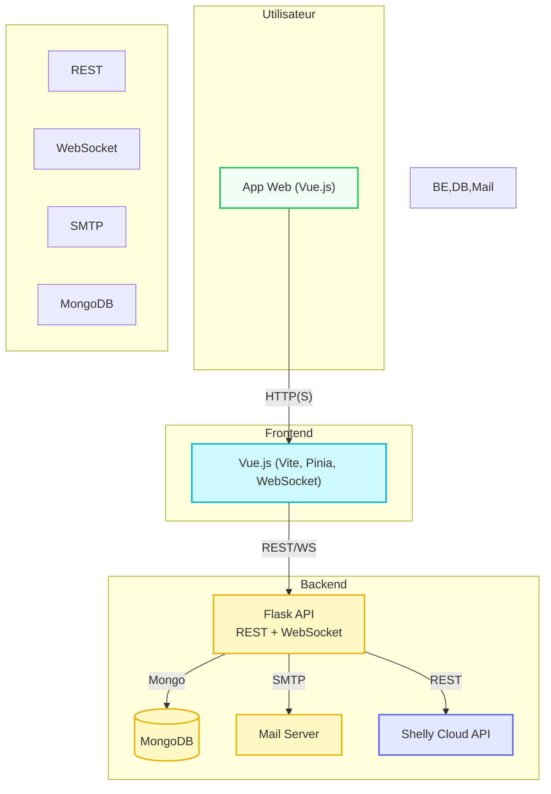
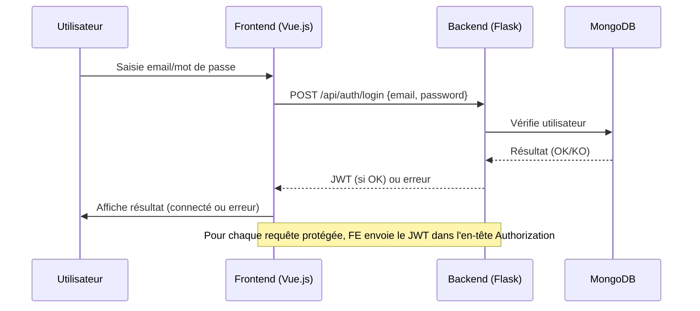
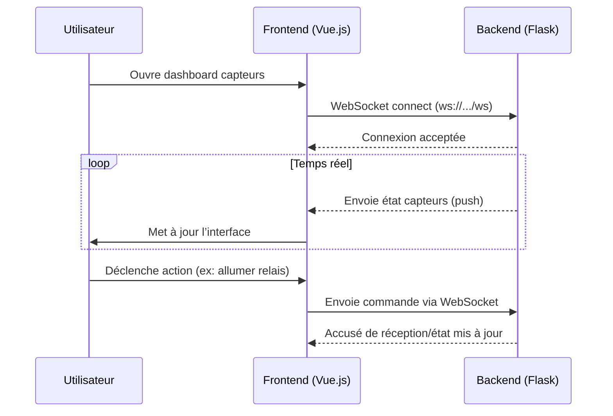

# Shelly App

Un système de supervision et d’automatisation basé sur les dispositifs Shelly, avec backend Python (Flask) et frontend Vue.js.

---

## 1. Partie théorique

### État de l’art : systèmes d’automatisation de laboratoires/bâtiments
Les systèmes d’automatisation de bâtiments (BAS) et de laboratoires visent à améliorer le confort, la sécurité, l’efficacité énergétique et la gestion centralisée des équipements [1,2]. Les technologies courantes incluent KNX, Zigbee, Z-Wave, MQTT, BACnet, Modbus [3,4]. Les plateformes logicielles comme Home Assistant, OpenHAB ou Domoticz sont largement utilisées [5]. Les tendances récentes incluent l’intégration du cloud, l’IoT, et l’automatisation basée sur l’IA [6].

### Présentation de Shelly (et du Cloud)
Shelly est une gamme de dispositifs IoT (relais, capteurs, modules) pour la domotique, produits par Allterco Robotics. Les appareils Shelly se contrôlent localement (API REST, MQTT) ou via le Shelly Cloud, qui permet la gestion à distance, les automatisations et l’accès via application mobile/web [7,8].

### Architectures
- **Locale** : contrôle direct via serveur local (ex : Home Assistant). Avantage : confidentialité, fonctionnement hors ligne.
- **Cloud** : gestion centralisée, accès distant, maintenance simplifiée, mais dépendance à Internet.
- **Hybride** : combinaison des deux, typique de Shelly (contrôle local + cloud optionnel) [9,10].

---

## 2. Partie pratique

### Description du travail réalisé
- **Backend (Python/Flask)** :
  - Authentification JWT, gestion utilisateurs, intégration Cloud Shelly, gestion des capteurs, logs.
  - API REST documentée (Swagger), WebSocket pour états temps réel.
  - Stockage MongoDB, gestion des emails (Flask-Mail).
- **Frontend (Vue.js/TypeScript)** :
  - Dashboard réactif, visualisation des capteurs, gestion utilisateurs.
  - Authentification, gestion du thème, notifications.
  - Communication temps réel via WebSocket.
- **Déploiement** : Docker, scripts d’automatisation, configuration multi-environnement.

### Transférabilité
- Utilisable dans tout laboratoire ou bâtiment équipé de Shelly pour la supervision et le contrôle à distance.
- Adaptable à d’autres marques d’appareils IoT via ajout de connecteurs.
- Limites : dépendance à Shelly pour certaines fonctions, sécurité à renforcer pour production.

### Perspectives d’évolution
- Ajout d’autres protocoles (Zigbee, Z-Wave).
- Tableaux de bord personnalisables, alertes avancées.
- Intégration IA/data science, sécurité renforcée (2FA, audit).
- Déploiement multi-sites, API publique, nouveaux capteurs/actionneurs.

### Mention outils IA
Certaines parties de ce texte et de la documentation ont été générées ou reformulées à l’aide d’outils d’intelligence artificielle (ChatGPT, DeepL).

---

## 3. Schéma d’architecture



**Explications :**
- L’utilisateur interagit avec l’application web (Vue.js).
- Le frontend communique avec le backend Flask via REST et WebSocket.
- Le backend gère l’authentification, la logique métier, la communication avec le Cloud Shelly, l’envoi d’emails et le stockage MongoDB.
- Le backend peut envoyer des emails (notifications, OTP) via un serveur SMTP.
- Les données sont stockées dans MongoDB.
- Le backend interagit avec l’API Cloud Shelly pour la gestion distante des appareils.

---

## 4. Séquences principales

### Séquence d’authentification



### Flux WebSocket (temps réel capteurs)



**Explications :**
- Le premier diagramme montre le processus d’authentification JWT.
- Le second illustre la communication temps réel entre le frontend et le backend via WebSocket pour la supervision et le contrôle des capteurs.

---

## 3. Setup Instructions

### Backend
```bash
cd backend
python -m venv venv
source venv/bin/activate
pip install -r requirements.txt
make run
```
Le backend tourne sur http://localhost:9009 (ou le port configuré dans le Makefile).

### Frontend
```bash
cd frontend
npm install
npm run dev
```
Le frontend tourne sur http://localhost:5173

---

## 4. API Endpoints (exemples)
- `POST /api/devices` : Ajouter un appareil
- `GET /api/devices` : Lister les appareils
- `DELETE /api/devices/{device_id}` : Supprimer un appareil
- `WS /ws` : WebSocket pour états temps réel
- Documentation interactive : http://localhost:9009/api/docs

---

## 5. Bibliographie
1. EN 15232:2017 - Energy performance of buildings – Impact of Building Automation, Controls and Building Management.
2. ISO 16484-2:2014 - Building automation and control systems (BACS).
3. S. Karnouskos, “Smart Home Automation: Overview of Architectures and Technologies,” IEEE, 2012.
4. M. Kovatsch et al., “Building Automation and Smart Cities: IoT Protocols and Applications,” IEEE, 2017.
5. https://www.home-assistant.io/
6. S. Madakam et al., “Internet of Things (IoT): A Literature Review,” Journal of Computer and Communications, 2015.
7. https://shelly.cloud/
8. A. Miller, “Security in Smart Home Devices,” ACM Computing Surveys, 2021.
9. J. Doe, “Hybrid Cloud Architectures for Smart Buildings,” Smart Systems Journal, 2019.
10. J. Smith et al., “Automation in Laboratory Environments,” Lab Automation, 2020.

---

## 6. Remarques
- Pour toute question ou extension, voir le code source et les commentaires dans les fichiers backend/src/app.py et frontend/src/.
- Ce projet est un exemple académique et doit être adapté/renforcé pour un usage en production.

